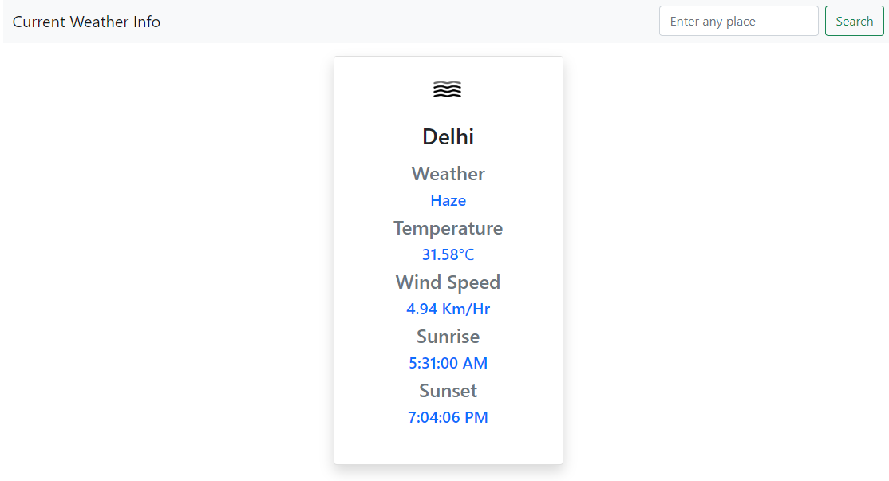

## Weather Project in Django

I know just for calling an API this is not an efficient method but I learned how to parse data from here and there.

> You can use flask for this simple task

### Interface

Just type your city and you will get live Weather!

